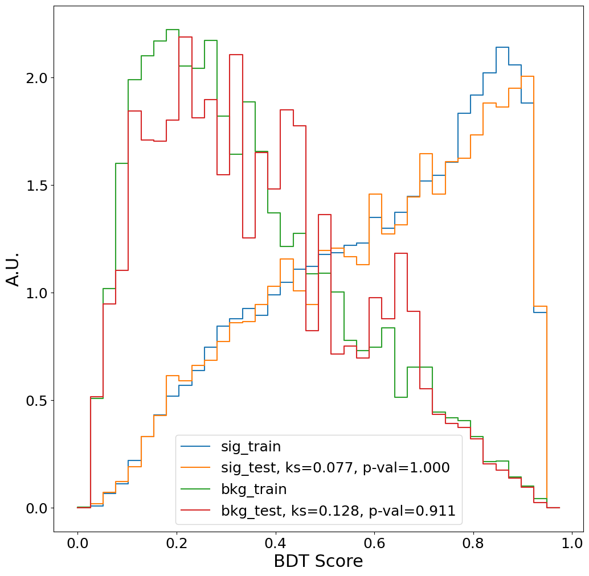
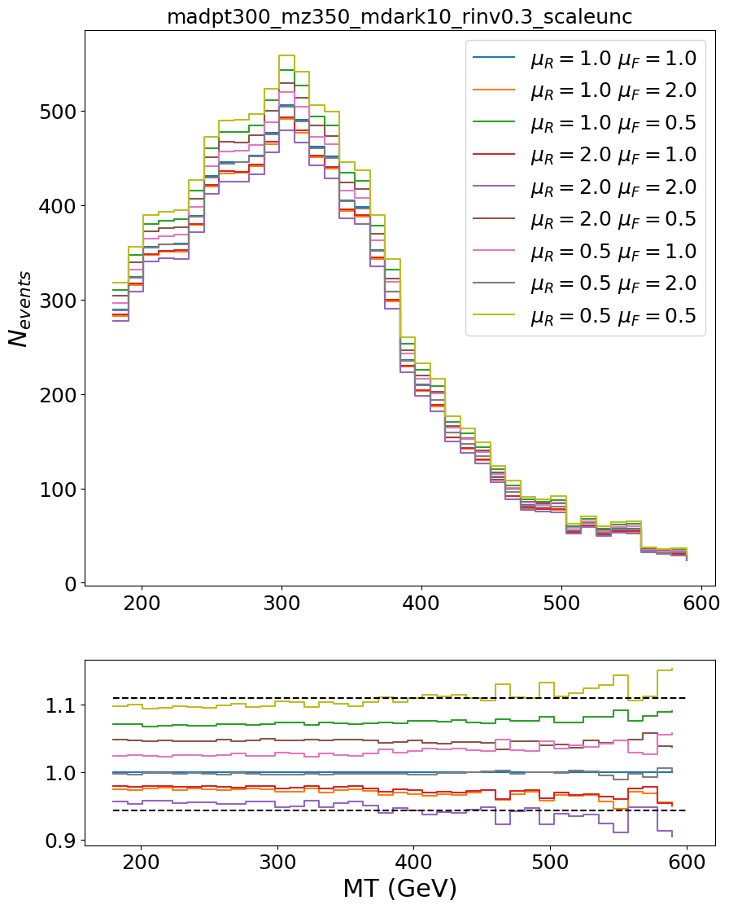

# About this repository

This is a repository that can train a uBoost or xgboost BDT for the SVJ boosted analysis.
It uses as much training data as it can, by using the precalculated TreeMaker Weight column.


## Setup

```
conda create -n bdtenv python=3.10
conda activate bdtenv  # Needed every time

conda install xgboost

pip install pandas
pip install requests
pip install numpy
pip install matplotlib

pip install svj_ntuple_processing
pip install hep_ml
```


## How to run a training

First download the training data (~4.7 Gb), and split it up into a training and test sample:

```bash
python download.py
python split_train_test.py
```

This should give you the following directory structure:

```bash
$ ls data/
bkg  signal  test_bkg  test_signal  train_bkg  train_signal

$ ls data/train_bkg/Summer20UL18/
QCD_Pt_1000to1400_TuneCP5_13TeV_pythia8.npz
QCD_Pt_120to170_TuneCP5_13TeV_pythia8.npz
... <more>
```

Then launch the training script:

```bash
python training.py xgboost \
    --reweight mt --ref data/train_signal/madpt300_mz350_mdark10_rinv0.3.npz \
    --lr .05 \
    --minchildweight .1 \
    --maxdepth 6 \
    --subsample 1. \
    --nest 400
```

Training with xgboost on the full background should take about 45 min.
The script `hyperparameteroptimization.py` runs this command for various settings in parallel.


## Evaluate

```bash
python evaluate.py
```

The paths to the model are currently hard-coded! Things are still too fluid for a good abstraction.


## Produce histograms

To produce the histograms needed for the limit setting, use:

```bash
python produce_histograms.py models/svjbdt_Nov29_reweight_mt_lr0.05_mcw0.1_maxd6_subs1.0_nest400.json
```

It creates a file called `histograms_%b%d.json`, which contains background and signal histograms for various BDT working points (currently 0.0 to 0.9).

To make some quick debug plots for the histograms:

```bash
python plot_histograms.py histograms_Dec01.json
```


## Cutflow table

```bash
python cutflow_table.py
```

Creates the cutflow tables to inspect the preselection efficiencies. Two example tables (run the script for more):

```
--------------------------------------------------------------------------------
bkg_summary
              qcd      ttjets   wjets    zjets    combined
xs            1.11e+05 1.31e+03 3.32e+03 4.01e+02 1.16e+05
raw           100.00%  100.00%  100.00%  100.00%  100.00%
ak8jet.pt>500 0.99%    0.99%    0.15%    0.27%    0.96%
triggers      0.93%    0.98%    0.15%    0.27%    0.91%
n_ak15jets>=2 0.93%    0.98%    0.15%    0.26%    0.91%
subl_eta<2.4  0.92%    0.98%    0.15%    0.25%    0.90%
subl_ecf>0    0.90%    0.96%    0.12%    0.20%    0.87%
rtx>1.1       0.09%    0.48%    0.06%    0.15%    0.10%
nleptons=0    0.09%    0.20%    0.03%    0.15%    0.09%
metfilter     0.09%    0.20%    0.03%    0.15%    0.09%
preselection  0.09%    0.20%    0.03%    0.15%    0.09%
stitch        0.09%    0.08%    0.03%    0.15%    0.09%
n137          1.39e+07 3.52e+05 1.30e+05 8.28e+04 1.44e+07
--------------------------------------------------------------------------------
signal
              mz250_rinv0.1 mz250_rinv0.3 mz350_rinv0.1 mz350_rinv0.3 mz450_rinv0.1 mz450_rinv0.3
xs            1.14e+02      1.14e+02      9.92e+01      9.92e+01      8.23e+01      8.23e+01     
raw           100.00%       100.00%       100.00%       100.00%       100.00%       100.00%      
ak8jet.pt>500 20.09%        19.06%        22.06%        21.02%        25.01%        23.40%       
triggers      19.78%        18.84%        21.77%        20.80%        24.74%        23.23%       
n_ak15jets>=2 19.78%        18.84%        21.77%        20.80%        24.74%        23.23%       
subl_eta<2.4  19.68%        18.71%        21.68%        20.68%        24.64%        23.12%       
subl_ecf>0    19.36%        18.28%        21.36%        20.22%        24.33%        22.66%       
rtx>1.1       3.95%         10.30%        5.07%         12.52%        6.21%         14.59%       
nleptons=0    3.81%         9.98%         4.87%         12.06%        5.94%         14.00%       
metfilter     3.77%         9.86%         4.80%         11.91%        5.87%         13.83%       
preselection  3.77%         9.86%         4.80%         11.91%        5.87%         13.83%       
stitch        3.77%         9.86%         4.80%         11.91%        5.87%         13.83%       
n137          5.89e+05      1.54e+06      6.53e+05      1.62e+06      6.63e+05      1.56e+06     
```


## Overfitting check: Kolmogorov-Smirnov test

```bash
python overfitting.py models/svjbdt_Nov29_reweight_mt_lr0.05_mcw0.1_maxd6_subs1.0_nest400.json
```



With p-values close to 1.0, there is no reason to assume any overfitting.


## Scale uncertainties

```
mkdir data/scaleunc
xrdcp root://cmseos.fnal.gov//store/user/lpcdarkqcd/boosted/signal_madpt300_2023_scaleunc/BDTCOLS/madpt300_mz350_mdark10_rinv0.3_scaleunc.npz data/scaleunc/
python study_scaleunc.py plot data/scaleunc/madpt300_mz350_mdark10_rinv0.3_scaleunc.npz models/svjbdt_Apr21_reweight_mt.json
```


